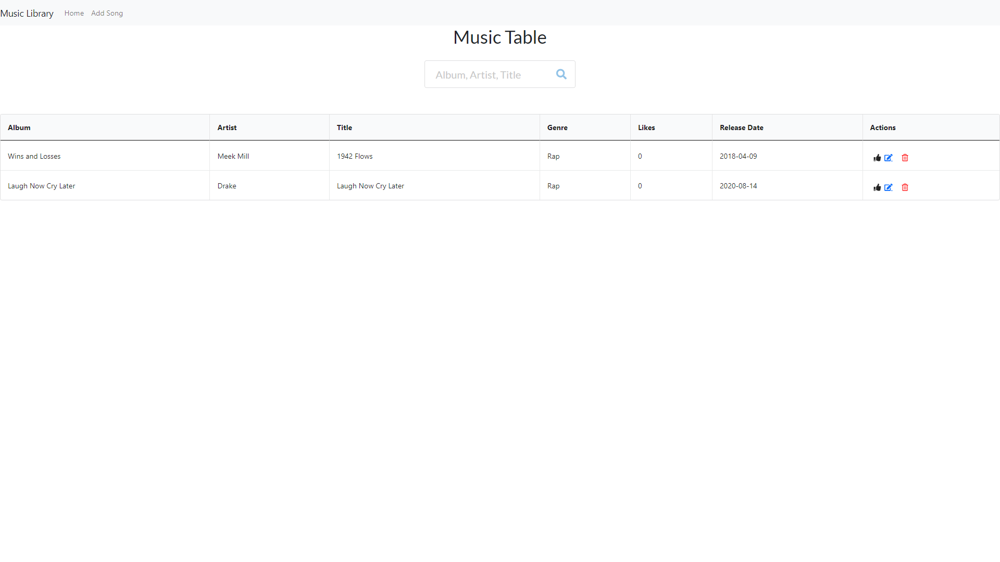

# Music Library
## Implementation of a Music tracking library web application

## Table of Contents
- [Project Status](#project-status)
   - [Goals](#goals)
   - [Task List](#task-list)
   - [Future Tasks](#future-tasks)
- [Technologies](#technologies)
- [Design](#Design)
- [Images](#Images)

---
## Project Status :green_circle:
### Goals
- Add functionality for adding a song to the music table
- Add functionality for liking a song
- Add functionality for removing a song
- Add functionality for updating a song
- Add functionality for searching for a song on the table

### Task List: 
:heavy_check_mark: Finished the functionality for adding a new song

:heavy_check_mark: Finished adding functionality for liking a song and icon for liking a song

:heavy_check_mark: Finished adding icon for removing a song and functionality of removing a song

:heavy_check_mark: Finished adding icon for updating a song and functionality of updating a song 

<!--- 
Emojis for the Task List:
DONE =      :heavy_check_mark:
NOT DONE =  :x:
WIP =       :recycle:
BUGGED =    :warning:
 --->

### Future Tasks  
:x: Add ability to create multiple collections of songs

:x: Add ability to click a song and embed a video from youtube api of that song

---
## Technologies
- Visual Studio Code
- React
- Bootstrap
- Git / GitHub

---
## Design
### Music Table Home
- Implemented a bootstrap table displaying the album, artist, title, genre, likes, release date, and actions
- Implemented a Search bar with icon allowing a user to search through songs by all fields besideds actions shown on table
### Add A New Song
- Implemented a bootstrap form allowing a user to create a new song consisting of the fields album, artist, title, genre, and release date
### Update a song
- Implemented a bootstrap prefilled form allowing a user to update a songs album, artist, title, genre, and release date

---
## Images

